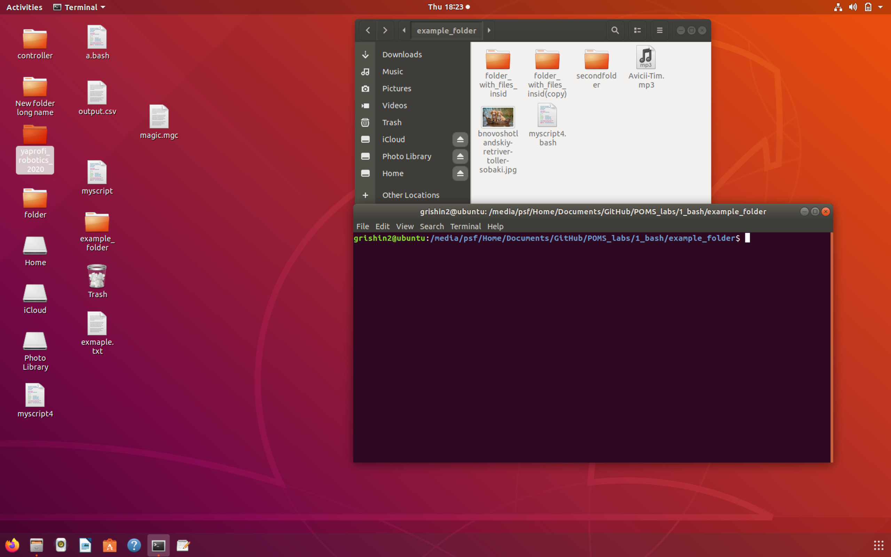

# отчет
– В качестве учебного пособия использован цикл [статей](https://habr.com/ru/company/ruvds/blog/325522/ ) .  
– Для проверки работоспособности есть тестовая папка example_folder.  
– При выполнении потребуется ввести пароль пользователя для загрузки пакета, определяющего длительность аудиофайлов.  
– Результаты выполнения скрипта внутри тестовой папки проще всего оценить посмотрев картинки ex1..ex2. 
.

– Выходным файлом является output.csv.  
# Выводы
В ходе выполнения работы а также в процессе просмотра и оценки решений данной задачи другими был сделан вывод о недостатках используемых методов. А именно:
- использование 
<ls -l>
лишает возможности получения имени файла/директории, содержащей пробелы и/или символы вроде <\*\_?\<\>>, так как при написании регулярного выражения.
- использовать сторонний пакет ( в данном случае <mp3info> ) не стоит, так как для работы необходимо сначала установить его, это потребует пароля пользователя. Корректнее и универсальнее использовать <ffmpeg>.
- вместо парсинга очередной строки из "ls -l" с помощью "awk" логичнее получать необходимые атрибуты о файле (из, например, <../*> отдельными командами с использованием регулярных выражений.
- скрипт [script.bash](https://github.com/grishinKirill/POMS_labs/blob/master/1_bash/script.bash) стоит рассматривать скорее как МОВЕТОН. Рекомендую обратить внимание на [пример 1](https://github.com/NightFozy/labs/blob/master/lab_1.sh) или на [пример 2](https://github.com/ToshbI4/ITMORobSoft/blob/master/first/lab1).